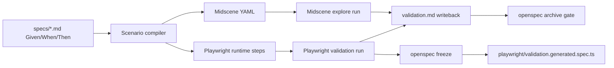

# Runtime Validation Loop

OpenSpec now supports a lightweight runtime-validation loop so spec scenarios can execute, report evidence, and gate archive.

## Why a dual-layer stack?

- **Midscene** is the exploration layer: generate YAML from natural-language scenarios and tolerate UI drift.
- **Playwright** is the guardrail layer: run deterministic browser checks and freeze passing flows into regression tests.



## Commands

```bash
openspec validate <change-id-or-path> [--target midscene|playwright|all]
openspec freeze <change-id-or-path>
openspec archive <change-id> [--skip-validation]
```

## Config

Create `openspec.config.json` at your project root:

```json
{
  "validation": {
    "baseUrl": "http://localhost:3000",
    "midscene": {
      "model": "gpt-4o",
      "apiKeyEnv": "OPENAI_API_KEY"
    },
    "playwright": {
      "configPath": "playwright.config.ts"
    }
  }
}
```

If the Midscene API key is missing, OpenSpec still generates Midscene YAML and marks those runs as skipped instead of failing the whole command.

## Example workflow

```bash
cd examples/demo-todo-app
npm start
# in another terminal
openspec validate /absolute/path/to/examples/demo-todo-app/openspec/changes/add-todo-list
openspec freeze /absolute/path/to/examples/demo-todo-app/openspec/changes/add-todo-list
```

The validation command writes `validation.md` beside the change and stores evidence under `.openspec-validation/`.
